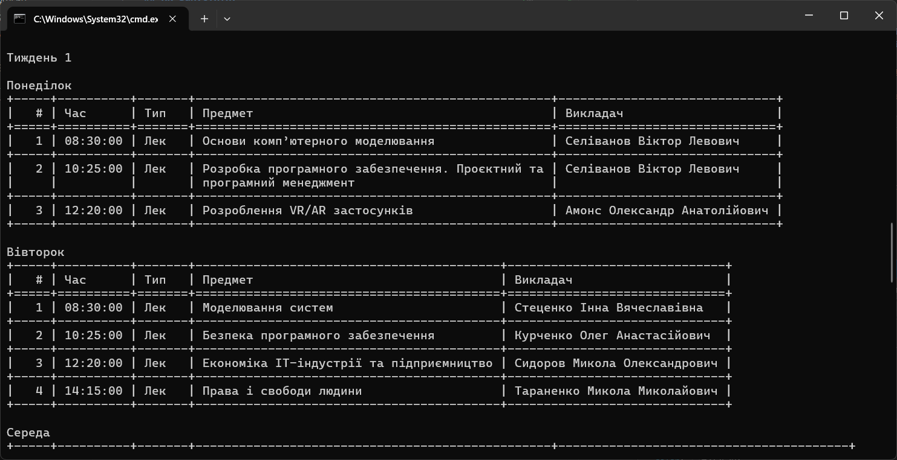
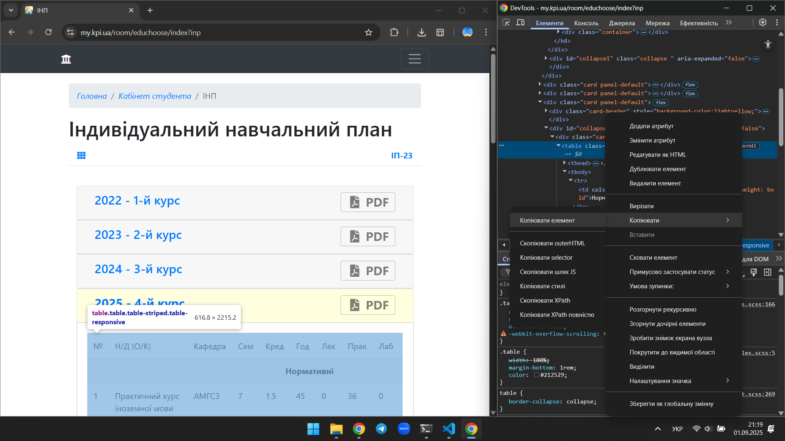

# ConsoleScheduleKPI
*Консольна програма для перегляду розкладу КПІ*



## Як запустити?

### Запуск Python-файлу 

Перейдіть у консоль/термінал та виконайте такі дії:

1. Завантаження файлів 

Клонуйте цей репозиторій

``` console
git clone https://github.com/gonivanko/ConsoleScheduleKPI.git
```

*Для цього варіанту необхідно мати встановлений git, який можна завантажити з офіційного сайту https://git-scm.com/downloads*

Або завантажте ("Code" --> "Download ZIP") та розпакуйте архів

2. Перейдіть у робочу папку:

``` console
cd ConsoleScheduleKPI
```

3. Запустіть файл main.py командою

``` console
py main.py
```

*Для цього кроку необхідно мати встановлений Python, який можна завантажити з офіційного сайту https://www.python.org/downloads/*

### Запуск exe-файлу

1. Перейдіть у розділ "Releases" на цій сторінці (https://github.com/gonivanko/ConsoleScheduleKPI)
2. Завантажте exe-файл (rozklad.exe)
3. [Бажано] Перемістіть файл в обрану вами папку
4. Запустіть файл rozklad.exe

## Де взяти HTML таблиці предметів?

Для цього потрібно перейти на сайт https://my.kpi.ua/ та обрати:

1. Тека користувача
2. Кабінет студента
3. ІНП (у розділі ІНП)
4. Розгорнути таблицю предметів поточного курсу
5. Навести курсором на таблицю та обрати "*Перевірити*" / "*Inspect*"
6. У вікні "Інструменти розробника" / "DevTools" обрати тег ```<table>``` для таблиці предметів та, натиснувши правою кнопкою ммиші, обрати "*Копіювати*" --> "*Скопіювати елемент*"
7. Вставити скопійований вміст у консоль

Приклад, як це робити:


